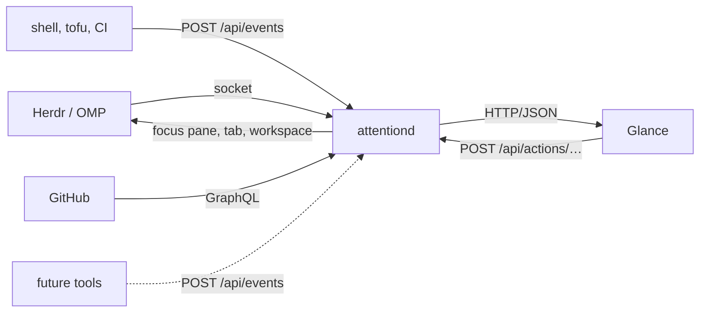

# attentiond

Local daemon holding one normalized view of what currently needs attention: it takes semantic lifecycle events from tools such as Herdr, command wrappers and GitHub, maps them onto the states working, waiting, needs_attention, done and failed, and serves them over localhost HTTP/JSON for UIs such as Glance.

It is not a frontend. It holds state and answers questions about it.



Sources push or are polled; Glance only reads and asks attentiond to act. The
arrow back to Herdr is the whole point of the action route: a dashboard that
tells you something needs you is half a tool unless it can also put you back
in front of it.

## Run it

```bash
go run ./cmd/attentiond                 # against a live Herdr server
go run ./cmd/attentiond --herdr-fixture testdata/session-snapshot.json
```

## Configuration

Settings live in a file, not on a command line, so a new source means a new
table rather than a longer invocation. attentiond reads `--config`, then
`$ATTENTIOND_CONFIG`, then `~/.attn/config.toml`.

The first two are explicit: somebody named a file, so a missing one is an
error. Only the implicit `~/.attn/config.toml` may be absent, and then the
defaults below run.

[`config.example.toml`](config.example.toml) is the annotated version of what
follows, ready to copy:

```bash
cp config.example.toml ~/.attn/config.toml
```

```toml
[daemon]
addr = "127.0.0.1:7717"        # must be loopback
# public_url = ""              # default http://<addr>, used to build action links
log_level = "info"             # debug, info, warn, error
log_format = "text"            # text or json

[events]
ttl = "1h"                     # how long finished /api/events items stay visible

[herdr]
enabled = true
poll = "2s"
# socket = ""                  # default: Herdr's own resolution order
# fixture = ""                 # replay a recorded snapshot instead of a live server

[github]
enabled = false                # see below
poll = "1m"
repos = []                     # owner/name; empty means every repository the token sees
orgs = []                      # account logins
stale_draft_after = "336h"
limit = 100                    # per search, before the result is reported incomplete
# api = "https://api.github.com/graphql"   # for GitHub Enterprise
```

A file only has to say what it changes; anything absent keeps its default. A
key attentiond does not know fails startup, because a key that is silently
ignored leaves the file claiming one thing and the daemon doing another.

GitHub defaults to off. An unconfigured GitHub source watches every repository
the token can see, and that is also what a machine would fall back to if its
config file went missing, so it waits to be asked. Herdr defaults to on: it is
local, it costs one socket call, and it is the reason the daemon exists.

Flags override the file for a single run and are deliberately few:
`--config`, `--addr`, `--public-url`, `--log-level`, `--log-format`,
`--event-ttl`, `--herdr-socket`, `--herdr-fixture`, `--herdr-poll`,
`--no-github`, `--github-poll`, `--github-repos`, `--github-orgs`,
`--github-limit`. Only flags actually typed are applied.

Record a fixture from a running Herdr with `herdr api snapshot > testdata/session-snapshot.json`.

## API

### `GET /api/work`, `GET /api/attention`

`/api/work` returns everything attentiond knows. `/api/attention` returns the
subset that wants a human: `needs_attention`, `failed`, and `done`. Done is in
there because finished work nobody has looked at is the point of the daemon;
Herdr reports `done` only while a completed agent is unseen and drops it to
`idle` once the pane is focused.

```json
{
  "generated_at": "2026-09-12T12:00:00Z",
  "count": 3,
  "attention_count": 1,
  "items": [
    {
      "id": "herdr:w2:p1",
      "source": "herdr",
      "title": "tofu · Codex: plan",
      "state": "needs_attention",
      "severity": "warning",
      "context": {
        "workspace_id": "w2",
        "workspace_label": "tofu",
        "tab_id": "w2:t1",
        "pane_id": "w2:p1",
        "agent": "codex",
        "herdr_status": "blocked"
      },
      "updated_at": "2026-09-12T11:58:41Z",
      "actions": [
        {
          "id": "focus",
          "label": "Open",
          "method": "POST",
          "href": "http://127.0.0.1:7717/api/actions/herdr/pane/w2:p1/focus"
        }
      ],
      "attention": true
    }
  ]
}
```

Items sort by severity, then by recency. `attention` is derived from `state`, so
a consumer never has to restate the rules.

### `POST /api/events`

How any local process reports its lifecycle. `source` and `id` together are the
item identity: repeat them to move the same item through its states.

```bash
curl -sS localhost:7717/api/events -d '{
  "source": "tofu",
  "id": "plan-prod",
  "event": "needs_attention",
  "title": "tofu plan wants approval",
  "context": {"dir": "~/didx.projects/tofu"}
}'
```

| Field | Required | Notes |
| --- | --- | --- |
| `source` | yes | free-form, but not a name an adapter owns (`herdr`) |
| `id` | yes | stable within the source |
| `event` | yes | `started`, `working`, `waiting`, `needs_attention`, `completed`, `failed` |
| `title` | no | defaults to `"<source> <id>"` |
| `severity` | no | `info`, `warning`, `critical`; defaults from the event |
| `context` | no | string map, passed through untouched |
| `url` | no | becomes an Open action |
| `timestamp` | no | RFC 3339, defaults to now |

Items that reach `completed` or `failed` disappear after `--event-ttl`.

### `POST /api/actions/{source}/{kind}/{target}/{action}`

Sends you back into the execution context an item came from. Consumers should
post the `href` from the item rather than building this path.

```bash
curl -sS -X POST localhost:7717/api/actions/herdr/pane/w1:p1/focus
```

Herdr supports `focus` for `workspace`, `tab`, and `pane`. Status codes: `404`
when the target is gone, `400` for an action the adapter does not have, `503`
when Herdr is unreachable or attentiond is running from a fixture.

### `GET /health`

Liveness plus per-adapter state. The daemon stays `ok` when an adapter is down,
because Herdr not running is normal.

```json
{
  "status": "ok",
  "version": "dev",
  "uptime_seconds": 143,
  "items": 4,
  "sources": {
    "herdr": {"mode": "socket", "healthy": true, "items": 3, "last_success": "2026-09-12T12:00:00Z"}
  }
}
```

## Herdr integration

attentiond polls Herdr's `session.snapshot` over its local socket every two
seconds and turns each detected agent into an item. Panes running an ordinary
shell are not reported. No terminal output is read: `agent_status` is a semantic
field Herdr already computes.

| Herdr `agent_status` | state | severity |
| --- | --- | --- |
| `working` | `working` | info |
| `idle` | `waiting` | info |
| `blocked` | `needs_attention` | warning |
| `done` | `done` | info |
| `unknown` | `waiting` | info |

Herdr never reports a failure, so `failed` only arrives through `/api/events`.

The socket is found the way Herdr documents it: `--herdr-socket`, then
`HERDR_SOCKET_PATH`, then the socket for `HERDR_SESSION`, then the default
session socket under the Herdr config directory.

## GitHub integration

attentiond asks GitHub once a minute for the open pull requests you authored
and the ones waiting on your review, and turns each into an item. One GraphQL
request answers review decision, mergeability and check rollup together; the
REST equivalent is three calls per pull request.

The credential is found without asking: `GITHUB_TOKEN`, then `GH_TOKEN`, then
`gh auth token`. No token means the source switches itself off with a warning,
because a machine that never logged into `gh` should still get a daemon. The
token is never logged and never leaves the process; `/health` names its origin,
not its value.

Each item carries the word a human uses for why it is there in
`context.pr_state`, separate from the five lifecycle states:

| `pr_state` | state | severity | when |
| --- | --- | --- | --- |
| `review requested` | `needs_attention` | warning | someone asked you, whatever the branch looks like |
| `rebase required` | `needs_attention` | warning | `mergeStateStatus` is `DIRTY` or `BEHIND` |
| `checks failing` | `failed` | warning | head commit rollup is `FAILURE` or `ERROR` |
| `changes requested` | `needs_attention` | warning | a reviewer sent it back |
| `checks running` | `working` | info | rollup is `PENDING` or `EXPECTED` |
| `ready to merge` | `needs_attention` | warning | approved and `CLEAN` |
| `approved` | `waiting` | info | approved but not mergeable yet |
| `awaiting review` | `waiting` | info | nobody has looked yet |
| `draft`, `stale draft` | `waiting` | info | drafts never enter the queue, however red |

Order matters: the first condition that holds is the one reported, so the most
actionable reason wins. A draft is a statement that it is not ready, so it is
checked before anything else and stays out of the attention queue. `stale draft`
needs `--github-stale-draft` to have elapsed since the last update.

`mergeStateStatus` is the only field that separates "behind base" from
"conflicting", and it still needs the `merge-info-preview` Accept header, which
the client sends.

Unlike the Herdr adapter, a failed poll keeps the last good result. Herdr being
unreachable means those panes are gone; GitHub being unreachable says nothing
about whether the pull requests still want you. `/health` turns unhealthy and
carries the error either way.

### Watching fewer repositories

Every repository your token can see is a lot of repositories. Narrow it in
`[github]`:

```toml
[github]
orgs = ["didx-xyz", "mach4-braai"]
repos = ["mcgeerdev/portfolio"]
```

Repeating a qualifier is how GitHub search spells OR, so repositories and
accounts union rather than intersect, and the scope applies to both searches.
`--github-repos` and `--github-orgs` take the same values comma separated, for
a one-off run.

A malformed entry fails startup rather than being ignored. GitHub answers an
unmatched qualifier with an empty result, and an empty attention queue is
indistinguishable from having nothing to do.

### Nothing is silently dropped

Both searches page through cursors until they run out or `--github-limit` is
reached. Hitting the limit sets a warning that travels with the data: `/health`
carries it on the source, and `/api/work` and `/api/attention` carry it in
`warnings`, so a consumer showing a capped list can say so. `healthy` stays
true, because the adapter works; the answer is just not the whole answer.

## Glance

`glance/attentiond.yml` is a runnable Glance config with two `custom-api`
widgets: the attention queue with action buttons, and a full work list.

```bash
glance --config glance/attentiond.yml
```

Action buttons POST into a hidden frame, so clicking Open focuses the Herdr pane
without navigating the dashboard away.

## State is in memory

Herdr-sourced items are rebuilt from a snapshot within one poll of a restart.
Event items are lost, which is the one real cost, and is acceptable while the
producers are builds and tests someone is watching. See
[docs/decision-brief.md](docs/decision-brief.md) for the reasoning and for the
rest of the MVP design.
