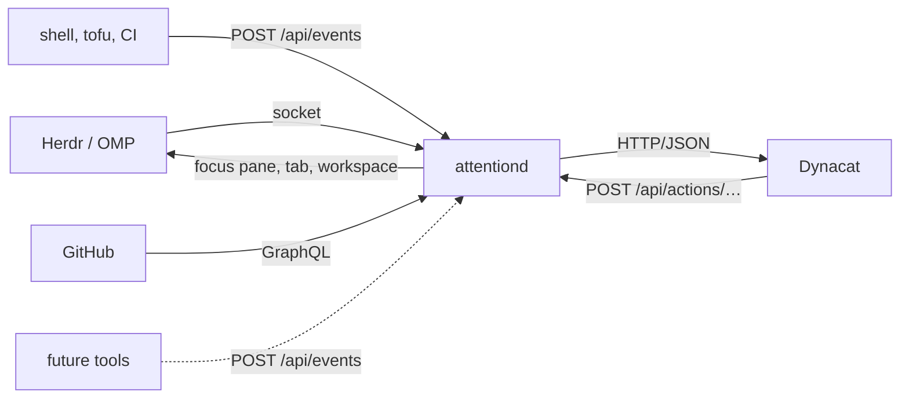

# attentiond

Local daemon holding one normalized view of what currently needs attention: it takes semantic lifecycle events from tools such as Herdr, command wrappers and GitHub, maps them onto the states working, waiting, needs_attention, done and failed, and serves them over localhost HTTP/JSON for UIs such as Dynacat.

It is not a frontend. It holds state and answers questions about it.



Sources push or are polled; the dashboard only reads and asks attentiond to
act. The arrow back into Herdr putting you in front of the work is the point
of the daemon holding state at all.

## Run it

```bash
go run ./cmd/attentiond                 # against a live Herdr server
go run ./cmd/attentiond --herdr-fixture testdata/session-snapshot.json
```

## Configuration

Settings live in a file, not on a command line, so a new source means a new
table rather than a longer invocation. attentiond reads `--config`, then
`$ATTENTIOND_CONFIG`, then `~/.attn/config.toml`.

The first two are explicit: somebody named a file, so a missing one is an
error. Only the implicit `~/.attn/config.toml` may be absent, and then the
defaults below run.

[`config.example.toml`](config.example.toml) is the annotated version of what
follows, ready to copy:

```bash
cp config.example.toml ~/.attn/config.toml
```

```toml
[daemon]
addr = "127.0.0.1:7717"        # must be loopback
# public_url = ""              # default http://<addr>, used to build action links
log_level = "info"             # debug, info, warn, error
log_format = "text"            # text or json

[attention]
top_labels = []                # labels that outrank every source's own ranking

[events]
ttl = "1h"                     # how long finished /api/events items stay visible

[herdr]
enabled = true
poll = "2s"
# socket = ""                  # default: Herdr's own resolution order
# fixture = ""                 # replay a recorded snapshot instead of a live server

[github]
enabled = false                # see below
poll = "1m"
repos = []                     # owner/name; empty means every repository the token sees
orgs = []                      # account logins
stale_draft_after = "336h"
priority_repos = []            # owner/name; their review requests rank first
limit = 100                    # per search, before the result is reported incomplete
# api = "https://api.github.com/graphql"   # for GitHub Enterprise
```

A file only has to say what it changes; anything absent keeps its default. A
key attentiond does not know fails startup, because a key that is silently
ignored leaves the file claiming one thing and the daemon doing another.

GitHub defaults to off. An unconfigured GitHub source watches every repository
the token can see, and that is also what a machine would fall back to if its
config file went missing, so it waits to be asked. Herdr defaults to on: it is
local, it costs one socket call, and it is the reason the daemon exists.

Flags override the file for a single run and are deliberately few:
`--config`, `--addr`, `--public-url`, `--log-level`, `--log-format`,
`--event-ttl`, `--herdr-socket`, `--herdr-fixture`, `--herdr-poll`,
`--no-github`, `--github-poll`, `--github-repos`, `--github-orgs`,
`--github-limit`. Only flags actually typed are applied.

Record a fixture from a running Herdr with `herdr api snapshot > testdata/session-snapshot.json`.

## API

### `GET /api/work`, `GET /api/attention`

`/api/work` returns everything attentiond knows. `/api/attention` returns the
subset that wants a human: `needs_attention`, `failed`, and `done`. Done is in
there because finished work nobody has looked at is the point of the daemon;
Herdr reports `done` only while a completed agent is unseen and drops it to
`idle` once the pane is focused.

```json
{
  "generated_at": "2026-09-12T12:00:00Z",
  "count": 3,
  "attention_count": 1,
  "items": [
    {
      "id": "herdr:w2:p1",
      "source": "herdr",
      "title": "tofu · Codex: plan",
      "state": "needs_attention",
      "severity": "warning",
      "label": "blocked",
      "tone": "attention",
      "priority": 10,
      "context": {
        "workspace_id": "w2",
        "workspace_label": "tofu",
        "tab_id": "w2:t1",
        "pane_id": "w2:p1",
        "agent": "codex",
        "herdr_status": "blocked"
      },
      "updated_at": "2026-09-12T11:58:41Z",
      "actions": [
        {
          "id": "focus",
          "label": "Open",
          "method": "POST",
          "href": "http://127.0.0.1:7717/api/actions/herdr/pane/w2:p1/focus"
        }
      ],
      "attention": true
    }
  ]
}
```

Items sort by priority, then severity, then recency. A consumer renders them in
the order it received them.

Three fields exist so that nothing downstream has to restate what the daemon
already knows:

| Field | What it answers |
| --- | --- |
| `label` | the word a human uses for why this is here |
| `tone` | how that word should read where there is colour |
| `priority` | what to clear first |

`state` is the lifecycle position and stays coarse: five values, which is what
the store and the API filters reason about. `label` is the specific reason, and
two labels often share a state. A pull request that is `review requested` and
one that is `ready to merge` are both `needs_attention`, and the difference is
the whole point of looking at the dashboard. Sources that have no better word
leave both unset and get the state's own.

`tone` is a closed set, so a consumer maps six values onto a palette instead of
carrying a table of every label in the system:

| Tone | Meaning |
| --- | --- |
| `ready` | one action from finished |
| `attention` | wants a human now |
| `failed` | broken |
| `active` | making progress by itself |
| `done` | finished and unread |
| `neutral` | somebody else's turn |

`priority` is a separate question from `severity`. Severity is how bad
something is, and nearly everything actionable is a warning, so sorting on it
alone leaves the queue in recency order. The ranks:

| Rank | What sits there |
| --- | --- |
| 100 | a label named in `[attention] top_labels`; no source sets this |
| 50 | a meeting starting soon, the only work here with a deadline |
| 40 | a pull request that is ready to merge |
| 30 | a review requested in a `priority_repos` repository |
| 20 | a review requested anywhere else |
| 10 | everything else that wants you: a blocked agent, failing checks, a rebase |
| 5 | done and unread |
| 0 | running, or somebody else's turn |

Every rank but the top is a property of the work, which is why a source can
decide it. `[attention] top_labels` is the judgement: it promotes a label to
100 because you said so about a class of work. A saved OpenTofu plan nobody
has approved is the case it exists for, since the lock is released but the
change is not in, and an unapproved plan is easier to forget than a pull
request sitting on a board.

It is resolved before the queue is sorted, so the `priority` a consumer reads
is the one it was ordered by. Matching folds case and surrounding space.

`attention` is derived from `state`, so a consumer never has to restate the
rules.

### `POST /api/events`

How any local process reports its lifecycle. `source` and `id` together are the
item identity: repeat them to move the same item through its states.

```bash
curl -sS localhost:7717/api/events -d '{
  "source": "tofu",
  "id": "plan-prod",
  "event": "needs_attention",
  "label": "waiting for approval",
  "title": "tofu plan wants approval",
  "context": {"dir": "~/didx.projects/tofu"}
}'
```

| Field | Required | Notes |
| --- | --- | --- |
| `source` | yes | free-form, but not a name an adapter owns (`herdr`) |
| `id` | yes | stable within the source |
| `event` | yes | `started`, `working`, `waiting`, `needs_attention`, `completed`, `failed` |
| `title` | no | defaults to `"<source> <id>"` |
| `label` | no | the word for why this is here; defaults to the state's own |
| `severity` | no | `info`, `warning`, `critical`; defaults from the event |
| `context` | no | string map, passed through untouched |
| `url` | no | becomes an Open action |
| `timestamp` | no | RFC 3339, defaults to now |

Items that reach `completed` or `failed` disappear after `--event-ttl`.

### `POST /api/actions/{source}/{kind}/{target}/{action}`

Sends you back into the execution context an item came from. Consumers should
post the `href` from the item rather than building this path.

```bash
curl -sS -X POST localhost:7717/api/actions/herdr/pane/w1:p1/focus
```

Herdr supports `focus` for `workspace`, `tab`, and `pane`. Status codes: `404`
when the target is gone, `400` for an action the adapter does not have, `503`
when Herdr is unreachable or attentiond is running from a fixture.

### `GET /health`

Liveness plus per-adapter state. The daemon stays `ok` when an adapter is down,
because Herdr not running is normal.

```json
{
  "status": "ok",
  "version": "dev",
  "uptime_seconds": 143,
  "items": 4,
  "sources": {
    "herdr": {"mode": "socket", "healthy": true, "items": 3, "last_success": "2026-09-12T12:00:00Z"}
  }
}
```

## Herdr integration

attentiond polls Herdr's `session.snapshot` over its local socket every two
seconds and turns each detected agent into an item. Panes running an ordinary
shell are not reported. No terminal output is read: `agent_status` is a semantic
field Herdr already computes.

| Herdr `agent_status` | state | label | tone |
| --- | --- | --- | --- |
| `working` | `working` | `working` | active |
| `idle` | `waiting` | `idle` | neutral |
| `blocked` | `needs_attention` | `blocked` | attention |
| `done` | `done` | `done` | done |
| `unknown` | `waiting` | `unknown` | neutral |

The label is Herdr's own word rather than a translation of it. The same pane
appears in Herdr's agent sidebar, and one that reads `blocked` there and
something else here costs a human the moment it takes to notice they are the
same pane.

Herdr never reports a failure, so `failed` only arrives through `/api/events`.

The socket is found the way Herdr documents it: `--herdr-socket`, then
`HERDR_SOCKET_PATH`, then the socket for `HERDR_SESSION`, then the default
session socket under the Herdr config directory.

## GitHub integration

attentiond asks GitHub once a minute for three sets of open pull requests and
turns each into an item. One GraphQL request per set answers review decision,
mergeability and check rollup together; the REST equivalent is three calls per
pull request.

| Search | `context.role` | Why it is there |
| --- | --- | --- |
| `author:@me` | `author` | you wrote it |
| `review-requested:@me` | `reviewer` | somebody is waiting on your opinion |
| `reviewed-by:@me` | `reviewed` | you already reviewed it, so you are probably the one merging it |

The third exists because approving a pull request consumes the review request.
Without it, a pull request you approved falls out of the queue at the moment it
becomes your job, which is the one moment it matters. Somebody else's branch,
approved by you, waiting on CI, is invisible right up until the point you
notice it a week later.

Not `involves:@me`, which looks like it should cover this. That qualifier
matches author, assignee, mentions and commenter, and not reviewer, so an
approval with an empty body is not something it can see. `reviewed-by:@me` asks
the question directly rather than hoping a review left a trace another
qualifier happens to index.

A live sample against `didx-xyz/tofu` does not settle it either way:
`involves:@me` returned nine pull requests including the approved one, but
`commenter:@me` returned it too, so it was reachable through a comment rather
than through the review. The argument for `reviewed-by` is the documented
semantics, not that measurement.

A pull request reached by more than one search is reported once, under the
first role that claims it: a pending request first, then your authorship, then
a review you already gave. A fresh request to look again outranks the review
you gave last week, because that is somebody waiting on you rather than a
branch waiting on CI.

The credential is found without asking: `GITHUB_TOKEN`, then `GH_TOKEN`, then
`gh auth token`. No token means the source switches itself off with a warning,
because a machine that never logged into `gh` should still get a daemon. The
token is never logged and never leaves the process; `/health` names its origin,
not its value.

Each item carries the word a human uses for why it is there in `label`, and
repeats it in `context.pr_state` for anything still reading that. It is
separate from the five lifecycle states, because several labels share one:

| `label` | state | tone | rank | when |
| --- | --- | --- | --- | --- |
| `review requested` | `needs_attention` | attention | 30 or 20 | someone asked you, whatever the branch looks like |
| `rebase required` | `needs_attention` | attention | 10 | `mergeStateStatus` is `DIRTY` or `BEHIND` |
| `checks failing` | `failed` | failed | 10 | head commit rollup is `FAILURE` or `ERROR` |
| `changes requested` | `needs_attention` | attention | 10 | a reviewer sent it back |
| `checks running` | `working` | active | 0 | rollup is `PENDING` or `EXPECTED` |
| `ready to merge` | `needs_attention` | ready | 40 | approved and `CLEAN` |
| `approved` | `waiting` | neutral | 0 | approved but not mergeable yet |
| `awaiting review` | `waiting` | neutral | 0 | nobody has looked yet |
| `draft`, `stale draft` | `waiting` | neutral | 0 | drafts never enter the queue, however red |

Order matters: the first condition that holds is the one reported, so the most
actionable reason wins. A draft is a statement that it is not ready, so it is
checked before anything else and stays out of the attention queue. `stale draft`
needs `--github-stale-draft` to have elapsed since the last update.

`ready to merge` is the only label with the `ready` tone and the only one
ranked above a review request. It is finished work held up by one click, which
makes it the cheapest thing on the board to clear.

A review request ranks 30 when the repository is in `[github] priority_repos`
and 20 otherwise. Nothing else is reordered by that setting, and it is not a
filter: a repository left out is still watched.

`mergeStateStatus` is the only field that separates "behind base" from
"conflicting", and it still needs the `merge-info-preview` Accept header, which
the client sends.

Unlike the Herdr adapter, a failed poll keeps the last good result. Herdr being
unreachable means those panes are gone; GitHub being unreachable says nothing
about whether the pull requests still want you. `/health` turns unhealthy and
carries the error either way.

### Watching fewer repositories

Every repository your token can see is a lot of repositories. Narrow it in
`[github]`:

```toml
[github]
orgs = ["didx-xyz", "mach4-braai"]
repos = ["mcgeerdev/portfolio"]
```

Repeating a qualifier is how GitHub search spells OR, so repositories and
accounts union rather than intersect, and the scope applies to every search.
`--github-repos` and `--github-orgs` take the same values comma separated, for
a one-off run.

A malformed entry fails startup rather than being ignored. GitHub answers an
unmatched qualifier with an empty result, and an empty attention queue is
indistinguishable from having nothing to do.

### Nothing is silently dropped

Every search pages through cursors until the results run out or
`--github-limit` is reached. Hitting the limit sets a warning that travels with
the data: `/health` carries it on the source, and `/api/work` and
`/api/attention` carry it in `warnings`, so a consumer showing a capped list
can say so. `healthy` stays true, because the adapter works; the answer is just
not the whole answer.

## Dynacat

`dynacat/attentiond.yml` is a runnable [Dynacat](https://github.com/Panonim/dynacat)
config with two `custom-api` widgets: the attention queue with action buttons,
and the full work list.

```bash
dynacat --config dynacat/attentiond.yml
```

Dynacat rather than Glance, which it forks, because its widgets refresh
themselves: a queue that only changes when you reload is a queue you have to
remember to reload. The widgets read `label` and `tone` and render items in the
order the daemon sent them.

Action buttons send a `fetch`, not a form submission: Dynacat serves
`form-action 'self'`, so a form posting to attentiond on another port is
dropped by the browser before it leaves. Clicking Open focuses the Herdr pane
without navigating the dashboard away. The widgets render whatever actions an
item carries, so new controls arrive without the templates knowing what they
are.

## State is in memory

Herdr items are rebuilt from a snapshot within one poll of a restart and
GitHub items within a minute. Event items are lost, which is the one real cost,
and is acceptable while the producers are builds and tests someone is watching.
See [docs/decision-brief.md](docs/decision-brief.md) for the reasoning and for
the rest of the MVP design.
